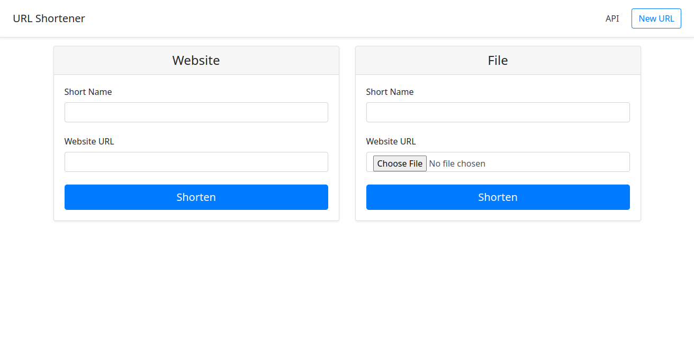

# URL Shortener
## Descrição
O URL Shortener é uma aplicação web para encurtamento de urls e nomes de arquivos produzida com o microframework Flask. Projeto concluído ao final do curso [Flask Essencial Training](https://www.linkedin.com/learning/flask-essential-training/web-development-with-flask)

## Linguagens utilizadas
- Python
- Javascript
- HTML

## Frameworks utilizados
- [Flask](https://flask.palletsprojects.com)
- [Bootstrap](https://getbootstrap.com/docs/4.3/getting-started/introduction/)

## Bibliotecas e dependências
- Front-end:
    - [jQuery Slim](https://jquery.com)
    - [popper.js](https://popper.js.org)

- Back-end:
    - pipenv
    - pytest

Para mais detalhes sobre dependências do Flask consulte o arquivo Pipfile.lock após rodar **$pipenv shell** 

## Pré-requisitos para instalação
- Python (versão 3.10 ou superior)
- pip3   (algumas distribuições identificam como **pip** a versão mais recente)
- git

## Instalação
No terminal clone o projeto:
```
$ git clone https://github.com/zapsys/url-shortener.git
```
Entre na pasta do projeto:
```
$ cd url-shortener
```
Instale o pipenv:
```
$ pip3 install pipenv 
```
ou
```
$ pip install pipenv 
```
Ative o ambiente de desenvolvimento:
```
$ pipenv shell
```
Instale o flask:
```
$ pipenv install flask
```
Exporte as variáveis de ambiente:
```
$ export FLASK_DEBUG=TRUE & export FLASK_APP=urlshort
```
Rode a aplicação:
```
$ flask run
```
Pronto agora é possível acessar a aplicação no browser pelo endereço http://127.0.0.1:5000 

## E voilá


## Testes
- As configurações de teste são salvas no arquivo [*conftest.py*](conftest.py). Esse arquivo será buscado pelo **pytest** durante a sua execução.
- Foi criado um arquivo de teste principal, o [*test_main.py*](test_main.py). Nele foi criada uma função para buscar um texto específico na aplicação, contudo, outras funções podem ser criadas, bem como outros arquivos de teste.

Para executar os testes acesse a pasta raiz (url-shortener) e instale o **pytest**:
```
$ pipenv install pytest
```
Rode o pytest:
```
$ pytest
```

## Dúvidas ou sugestões
Caso tenha alguma dúvida ou sugestão sinta-se a vontade para nos contactar e contribuir.

## Licença
Esse projeto foi construído seguindo os passos do instrutor do Linkedin [Nick Walter](https://linkedin.com/in/nick-walter), então os direitos de produção do código fonto original se devem a ele.

Mas eu deixo esse projeto sob a licença MIT, que permite o download, execução, alteração, redistribuição, tanto para uso privado como comercial do código fonte, desde que citado o autor. 

[MIT License](LICENSE.md)


